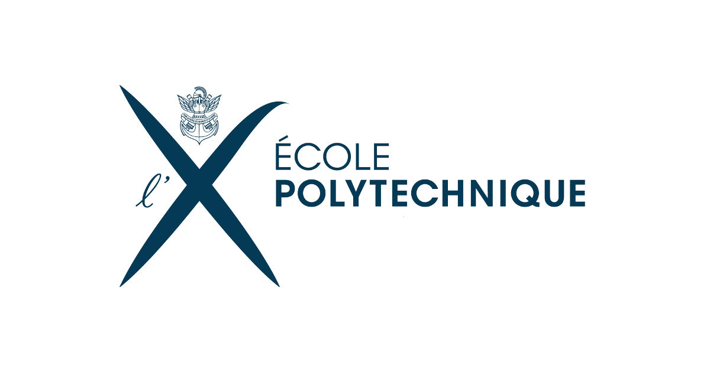

---
output:
  html_document:
    number_sections: no
    toc: yes
    toc_float:
      collapsed: false
      smooth_scroll: false
---	

<a href="documents/CV.pdf">CV détaillé ici</a>

## Experience professionelles 

  

## Éducation

 

  

- *2016-2019* :  Thèse de doctorat au Laboratoire d'Écologie Alpine, *Vers une théorie spatiale des réseaux d'interactions en écologie: concepts, méthodes et applications* sous la direction de Wilfried Thuiller

- *2012 – 2016* :  
Ingénieur de l'École polytechnique

  

- *2010 - 2012* :
Classes préparatoires Maths, Physique, Chimie, Lycée Louis-Le-Grand, Paris 

- *2010* :  
Baccalauréat Scientifique, Mention Très bien. Metz (57).

  

## Compétences 

 

- Biostatistiques

- Analyse de données

**Programmation**

- *Langages* :  
R / Python / Bash / Latex

- *Outils* :  
Git

  

## Projets

 

  [ANR Econet]((https://cmatias.perso.math.cnrs.fr/ANR_EcoNet.html)), Advanced statistical modelling of ecological networks 

 
 
 
 

 [ORCHAMP](https://orchamp.osug.fr/home) , Observatoire spatio-temporel de la biodiversité et du fonctionnement des socio-écosystèmes de montagne 

 

  - *Participation à l'installation des placettes et aux campagnes d'échantillonage de la biodiversité depuis 2016.*  
  - *Analyse des données d'ADN environnmental du sol*
 
 

 
 
Carte des gradient ORCHAMP

 
 

 
 
Installation d'une placette au dessus du glacier d'Argentière, massif du Mont-Blanc 

 

 
 
Prélèvement de sol pour analyser l'ADN environnemental à l'Armenaz, Bauges

 

  
Piège photographique dans le vallon de Mercuel, en Tarentaise

