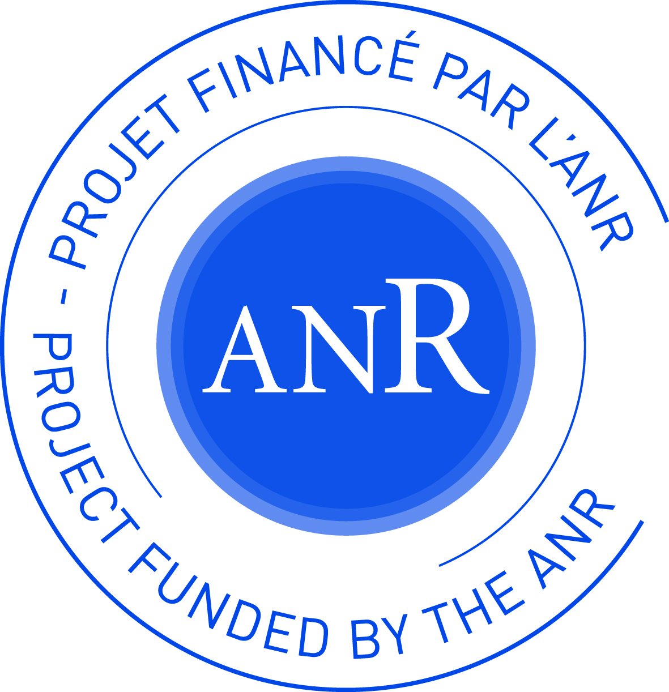
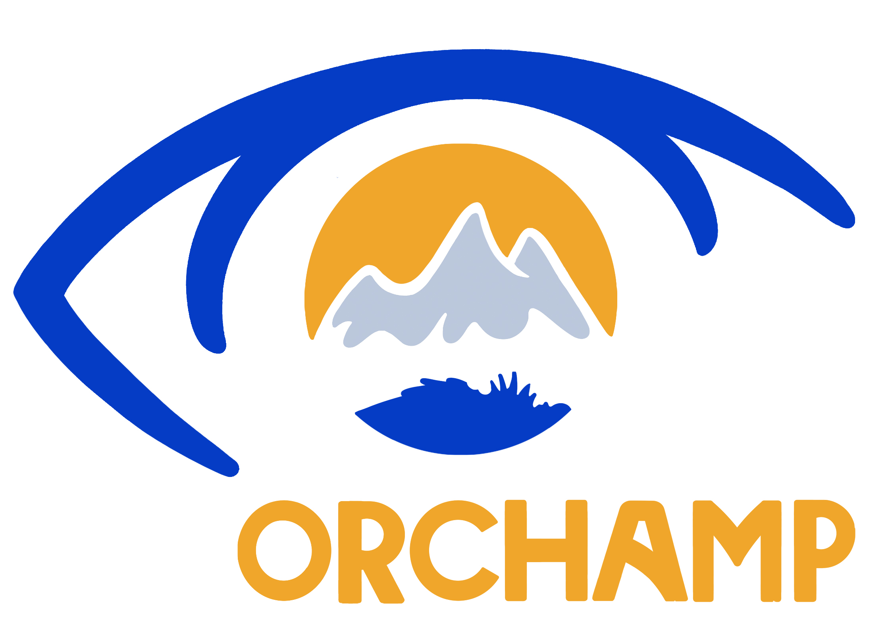

---
output:
  html_document:
    number_sections: no
    toc: yes
    toc_float:
      collapsed: false
      smooth_scroll: false
---	

<a href="documents/CV.pdf">CV détaillé ici</a>

## Experience professionelles 

  

## Éducation

 

  

- *2016-2019* :  Thèse de doctorat au Laboratoire d'Écologie Alpine, *Vers une théorie spatiale des réseaux d'interactions en écologie: concepts, méthodes et applications* sous la direction de Wilfried Thuiller

- *2012 – 2016* :  
Ingénieur de l'école Polytechnique

  

- *2010 - 2012* :
Classes préparatoires Maths, Physique, Chimie, Lycée Louis-Le-Grand, Paris 

- *2010* :  
Baccalauréat Scientifique, Mention Très bien. Metz (57).

  

## Skills

 

**Programming**

- *Languages* :  
R / Python / Latex

- *Tools* :  
Git

  

## Projets

 

-   ANR Econet, *Advanced statistical modelling of ecological networks*

 
 

-  ORCHAMP, Observatoire spatio-temporel de la biodiversité et du fonctionnement des socio-écosystèmes de montagne

