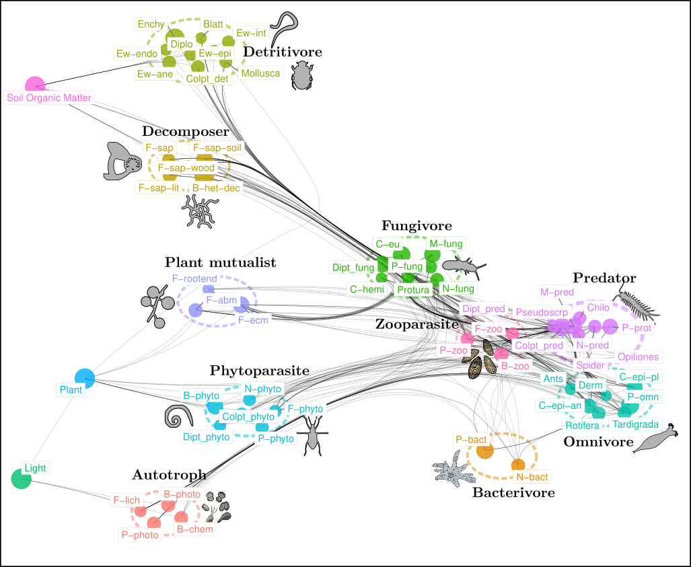

---
output:
  html_document:
    number_sections: no
    toc: yes
    toc_float:
      collapsed: false
      smooth_scroll: false
---

  

 

 Post-doc at [Alpine Ecology Lab](https://leca.osug.fr/), Grenoble, France. 

My research focuses on the modelling of interaction networks in ecology, at the crossroads between community ecology, statistics and computer science, and aims to enhance the interactions between these disciplines.

 **General research topics** 

I am interested in the development of methods to represent, infer and analyze the structure and dynamics of interaction networks. If the developed methods have a rather general scope in ecology, I focus on their application to soil ecology on environmental DNA data from the [ORCHAMP](https://orchamp.osug.fr/home) observatory program. 
In particular, I develop and implement:

- network comparison methods and diversity indices 

- methods for inferring statistical associations between species distributions

- food web representation methods based on diffusion algorithms

- spatially explicit metacommunity models by integrating spatial and interaction networks

 Chercheur en post-doctorat au [Laboratoire d'Ecologie Alpine](https://leca.osug.fr/). 

Mes travaux de recherche portent sur la modélisation des réseaux d'interactions en écologie; ils se placent à l'intersection de l'écologie des communautés, des statistiques et de l'informatique et visent à approfondir le dialogue entre ces disciplines.

 **Thèmes généraux de recherche** 

Je m'intéresse au développement de méthodes qui permettent de représenter, d'inférer et d'analyser la structure et la dynamique des réseaux d'interactions. Si les méthodes développées ont une portée assez générale en écologie, je m'attache à leur application à l'écologie du sol sur des données d'ADN environnemental issues de l'observatoire [ORCHAMP](https://orchamp.osug.fr/home). 
En particulier, je développe et implémente :

- des méthodes de comparaison de réseaux et des indices de diversité 

- des méthodes d'inférence d'associations statistiques entre distributions d'espèces

- des méthodes de représentation de réseaux trophiques basées sur des algorithmes de diffusion

- des modèles de métacommunautés spatialement explicites en intégrant réseaux spatiaux et d'interactions

  

