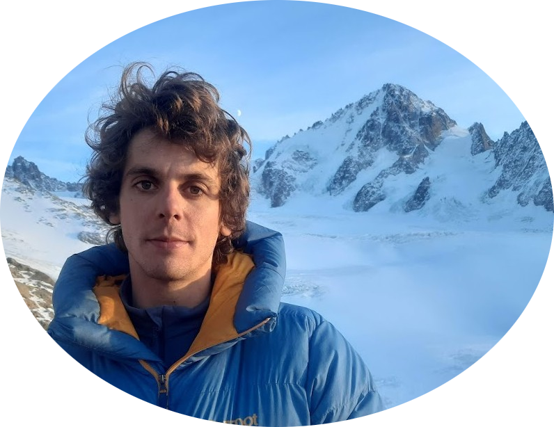

---
output:
  html_document:
    number_sections: no
    toc: yes
    toc_float:
      collapsed: false
      smooth_scroll: false
---

  

 

Post-doc at Alpine Ecology Lab, Grenoble, France.

My research focuses on the modelling of interaction networks in ecology, at the intersection of community ecology, statistics and computer science, and aims to enhance the interactions between these disciplines.

**General research topics**

Chercheur en post-doctorat au [Laboratoire d'Ecologie Alpine](https://leca.osug.fr/).

Mes travaux de recherche portent sur la modélisation des réseaux d'interactions en écologie; ils se placent à l'intersection de l'écologie des communautés, des statistiques et de l'informatique et visent à approfondir le dialogue entre ces disciplines.

**Thèmes généraux de recherche**

Je m'intéresse en particulier au développement de méthodes qui permettent de représenter, d'inférer et d'analyser la structure et la dynamique des réseaux d'interactions. Si les méthodes développées ont une portée assez générale en biologie, je me suis particulièrement attaché à leur application à l'écologie du sol sur des données d'ADN environnemental. Mes travaux de thèse se sont concentrés sur la comparaison de réseaux trophiques, l'inférence d'associations statistiques entre distributions d'organismes ainsi que sur la modélisation spatialement explicite de méta-communautés. Je cherche maintenant à approfondir ces méthodes pour tenter de mieux dévoiler la complexité des interactions trophiques du sol et leur variabilité dans l'espace et dans le temps.

  

